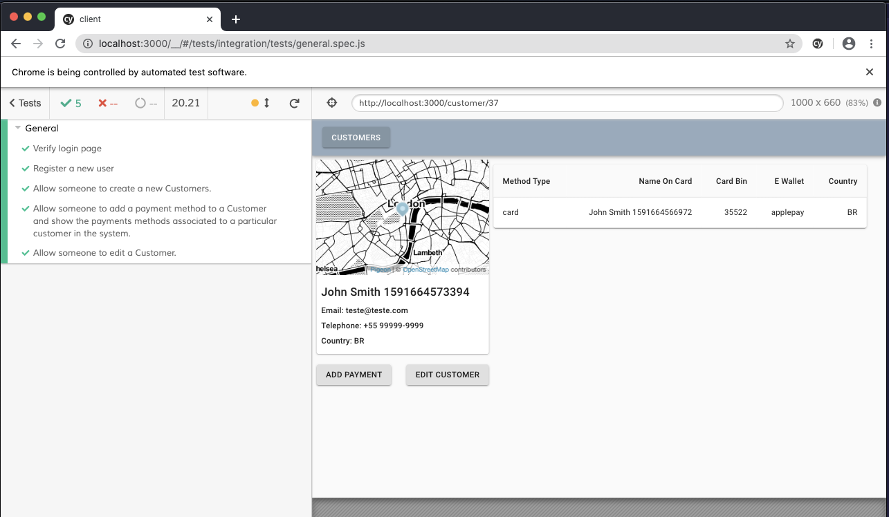

# GO-React starter



## Getting started

### With Docker

 - Install [Docker](https://docs.docker.com/get-docker/) 

 - Install [Docker Compose](https://docs.docker.com/compose/install/) 

### Without Docker

 - Download and install [golang](https://golang.org)

 - Download and install [postgres](https://www.postgresql.org/download/)
    - [Setup Postgres](https://www.codementor.io/engineerapart/getting-started-with-postgresql-on-mac-osx-are8jcopb): Setting up postgres on a mac

   - [Setup postgres- windows](https://www.robinwieruch.de/postgres-sql-windows-setup/): Setting up postgres on windows

## Usage
Clone this repository

### With Docker

```
docker-compose up
```

That's all :)

### Without Docker

Use the queries in the [server/db/.psql](./server/db/.postgres) file to setup the database.

Enter the DB creds in the [server/config/](./server/config/config.go) file 

Navigate to the server directory

```bash
> cd server
> go run main.go
```

This will start the go server.

To start the react app navigate to the client directory

```bash
> cd client
> yarn install
> yarn start
```
### Endpoints

* /session [GET]

* /register [POST]
     
```js
       { name String,
         email String,
         password String
       }
```
* /login [POST]
```js
       { email String,
         password String
       }
```
## Routes
* /login

* /register

* /session

## Running tests

```bash
> cd client
> yarn install
> yarn run cypress open
```

Run the `general.spec.js` inside `tests` folder and watch the application being tested 🍿

## Contributing
Pull requests are welcome. For major changes, please open an issue first to discuss what you would like to change.


## License
[MIT](https://choosealicense.com/licenses/mit/)
